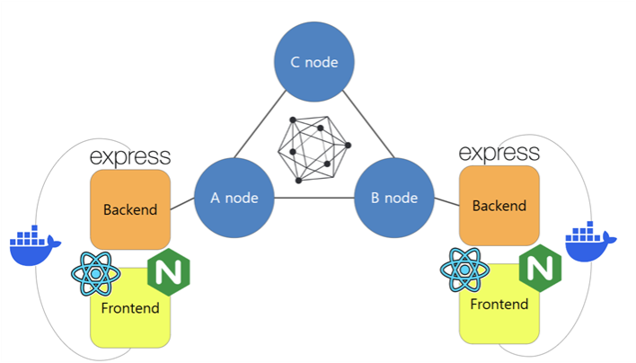
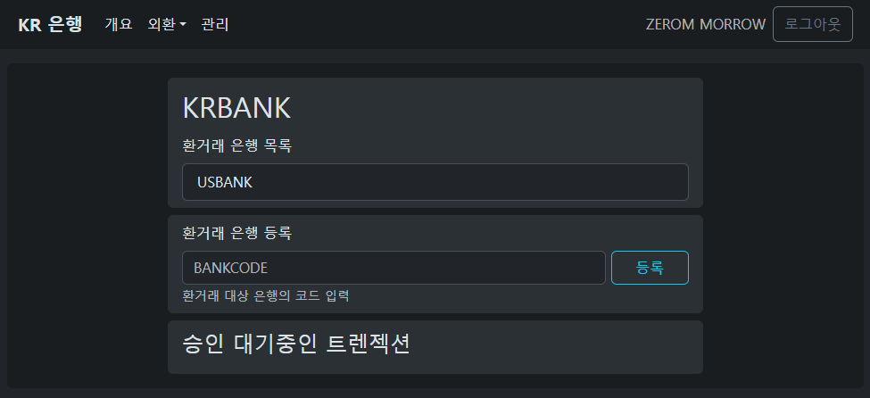
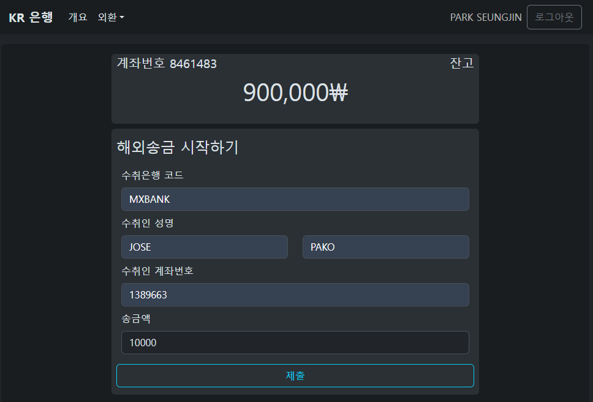
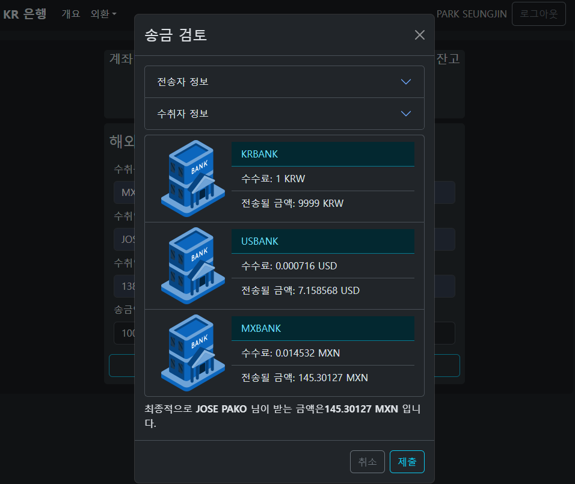
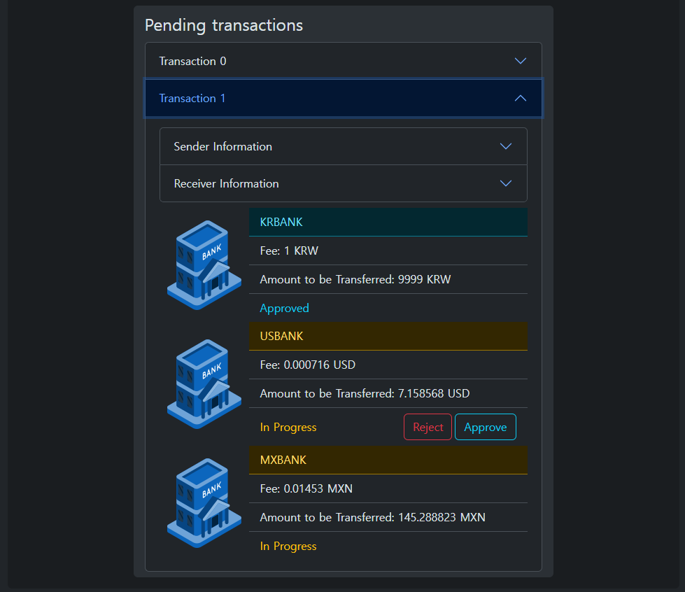
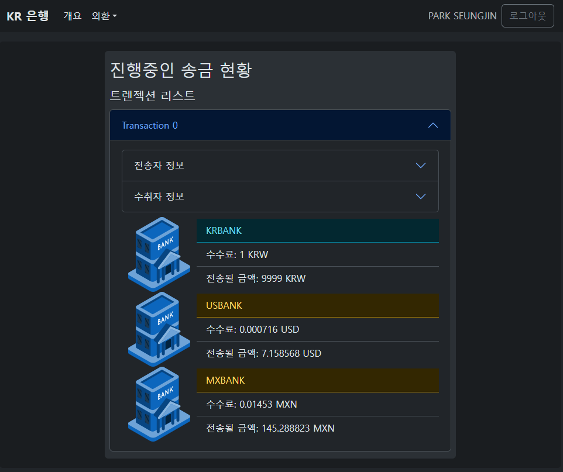

# Hyperledger fabric 을 이용한 은행간 송금 네트워크 프로토타입

## 2024 광운대학교 졸업작품

## 작품 개요

2023년 글로벌 송금 규모는 약 6,690억 달러로 추산되며, 저소득 및 중간소득 국가(LMICs)로의 송금액이 주를 이룬다. 특히 인도, 멕시코, 중국, 필리핀, 이집트 등이 주요 수취국이며 많은 국가 GDP의 상당 비율을 차지하고 있다. 예를 들어 타지키스탄과 통가에서는 GDP의 절반에 가까운 비율을 송금이 차지하고 있다.

해외송금이 여러 국가에 지대한 영향을 끼치는 한 편, 세계적으로 해외 송금 비용은 여전히 높아 평균적으로 약 6% 수준이다. 이러한 수수료는 사용자에게 적지않은 부담으로 다가오며 공식적인 방법이 아닌 비공식적인 방식으로 유도하며 이는 투명성 저하, 보안문제를 초래할 수 있다. [G20 은 이러한 이유로 해외송금을 개선하는것을 새로운 목표로 제시](https://www.fsb.org/2023/10/g20-roadmap-for-enhancing-cross-border-payments-consolidated-progress-report-for-2023/)하고 있다.

2008년 비트코인의 등장으로 세계 금융에 새로운 패러다임을 제시했다. 비트코인을 소유한 사람은 peer-to-peer로 별도의 third-party 없이 자신의 자산을 전달할 수 있게 되었다. 그러나 기존 금융 시스템의 규제는 특정 중개자나 감독 기관을 중심으로 이루어지는데, 비트코인은 이러한 전통적 개념에 맞지 않으며, 이로 인해 금융 안정성과 규제 준수 측면에서 불확실성을 초래한다. 예를 들어, 세금 부과 방식, 자금 세탁 방지, 거래 투명성 등의 이슈에서 비트코인이 규제와 충돌하는 부분이 있기에 비트코인은 여러 국가에서 정식으로 통합되기 어렵고, 이러한 법적 모호성이 대중적인 사용과 수용을 저해하는 주요 요인으로 작용하고 있다.

따라서 여러 국가, 기업체들은 비트코인과 같은 비허가형 블록체인이 아닌 허가형 블록체인이 지닌 가능성에 초점을 두고있다. 블록체인은 크게 public, consortitum, private 블록체인으로 나뉘는데 public 블록체인을 제외하면 허가형 블록체인으로 분류된다.

|               | Public                                 | Consortium                                        | Private                                    |
| ------------- | -------------------------------------- | ------------------------------------------------- | ------------------------------------------ |
| 관리 주체     | 모든참여자                             | 컨소시움 참여자                                   | 하나의 중앙 제어기관                       |
| 정부          | 만들어진 규칙을 제어하기가 매우 어려움 | 컨소시움 참여자간 합의를 통해 규칙을 만들 수 있음 | 중앙 기관에 의해 쉽게 변경 가능            |
| 트렌젝션 속도 | 속도를 증가시키기 어려움               | 네트워크가 쉽게 확장되며 속도가 빠름              | 네트워크 확장이 매우쉬우며 속도도 매우빠름 |
| 데이터 접근   | 모두가 접근 가능                       | 허가된 사용자만 접근 가능                         | 허가된 사용자만 접근 가능                  |
| 특정성        | 거의 익명                              | 특정가능                                          | 특정가능                                   |
| 트렌젝션 증명 | 합의 알고리즘 - POW, POS               | 신뢰성을 전제로 PBFT 나 Raft, 투표기반으로 진행   | 중앙 기관이 전적으로 담당                  |

금융 산업은 DLT 기술이 기존 시스템의 5가지 결함(보안, 속도, 투명성, 추적성, 리스크, 비용관리)을 해결할 수 있다고 식별한다. 분산원장은 단일접점의 실패를 극복하고 트렌젝션의 모든 생애주기가 식별가능하며 거래 정보가 사일로에 갇히지 않는 분산된 원장에 기록되는 투명성, 비용 효율성을 지닌다.

이러한 변화의 잠재성을 확인하고자 본 프로젝트를 시작하게 되었다. 엔터프라이즈형 컨소시움 블록체인 프레임워크인 hyperledger-fabric 을 직접 다뤄보고, 핵심 소재인 스마트계약을 제작하도록한다. 또한 간단한 풀스텍 은행 데모 웹앱을 만들어 만들어진 블록체인과 통합하여 송금 결제 과정을 확인해 본다.

## 프로젝트 구성

### 기술 스택

본 프로젝트에서 쓰인 기술들은 다음과 같다.

- <b>hyperledger-fabric</b>: 블록체인 구축
- <b>hyperledger-fabric-sdk</b>: javascript 를 이용하여 스마트 컨트랙트 제작
- <b>express</b>: 데모 은행 웹앱 백엔드 구축
- <b>reactjs</b>: 데모 은행 웹앱 프론트엔드 구축
- <b>react-i18n</b>: 3가지 언어(한국어, 영어, 스페인어)를 동시지원하기 위한 모듈
- <b>bootstrap</b>: 데모 은행 웹앱 UI 프레임워크
- <b>nginx</b>: react 를 serve 할 웹서버, 프론트와 백엔드를 연결하기 위한 reverse proxy 구성
- <b>docker</b>: 은행 웹앱을 container화 하여 compose 형태로 구축

이 밖에도 여러 앱을 빌드하기 위해 자동화 스크립트를 제작하는데 bash 스크립트가 사용되었다.

### 아키텍처

hyperledger fabric을 이용해 컨소시움 블록체인을 구축하고 container화 된 웹앱과 연결시켰다. 웹앱에서 블록체인에 트렌젝션을 제출하거나 state를 fetch 하여 정보를 온체인 활용한다.

## 프로세스

### 1단계: 은행 관계 setup

블록체인을 사용한다고 하지만 토큰화를 통해 유동성을 처리하는 프로젝트는 아님을 밝힌다. 온전히 각자의 사일로에 존재하는 데이터를 쉽게 공유하고 트렌젝션의 실시간성을 확인하는 목표를 갖고 있다. 따라서 correspendent-bank-relationship 에서 자유로울 수는 없다. 은행 웹앱의 어드민, 관리자는 실제 환거래 은행을 맺고 있는 은행의 코드를 각자 한번씩 등록 해야 한다.

### 2단계: 유저 송금

유저는 가상의 계좌와 balance 를 지급받는다. 그리고 간단한 정보를 기입하여 해외송금을 시작할 수 있도록 form 을 구성했다.

송금을 시작하려면 정보를 기입하고 제출버튼을 클릭한다. 클릭하면 다이얼로그가 등장하는데 여기에는 전체 송금의 과정을 미리 보여준다. 어떤 은행을 거쳐 얼마의 수수료를 요구하고 최종 도달되는 금액을 해당 국가의 화폐로 보여진다. 제출을 클릭하면 블록체인 네트워크에 트렌젝션으로 제출되어 타 은행에서 이벤트를 수신할 수 있게 된다.

### 3단계: 어드민 승인

각 은행의 어드민은 이전 단계에서 제출된 트렌젝션을 목록으로 확인할 수 있다. 이는 블록체인에 생성된 이벤트를 백엔드에서 수신한 결과이다. 어드민은 해당 트렌젝션의 정보를 투명하게 확인할 수 있으며 승인 프로세스를 진행할 수 있다.

### 4단계: 유저 추적

legacy 시스템이 갖는 문제중 하나는 추적성의 부족이다. 기존의 해외송금에서의 추적은 사일로에 존재하는 데이터를 하나하나 추적해야 했다. 블록체인기반의 송금 플렛폼은 이러한 데이터가 P2P, 분산원장으로 공유되므로 어느 노드던간에 트렌젝션의 현 상황을 확인할 수 있다. 따라서 다음 화면에서는 송금을 진행한 유저가 어떤 상태인지, 어느단계인지 쉽게 파악이 가능하다.

## 기대효과 및 한계

hyperledger를 이용하여 블록체인을 구축하고 송금에 관여하는 은행들을 참여자로 등록시키면 다음과 같은 이점들을 얻을 수 있을것으로 보인다.

1. 투명성: 모든 트렌젝션은 온체인에서 투명하게 공개되므로 기존 송금에서 각 단계에서 겪는 정보격차가 해소된다.
2. 원자성: 송금에 참여할 은행, 환율, 수수료는 스마트 컨트랙트에 의해 처음에 지정되고 각 은행은 승인프로세스를 거치기만 하면 된다. 이는 매번 은행과 은행사이의 결제, 청산이 이루어지던 방식과 다르게 원자적으로 이루어지며 이를 통해 리스크를 감소시킬 수 있다.
3. 규제준수 용이: 규제를 준수하기 위해 특정 기관에 정보를 제공해야 하는 경우 그러한 기관이 블록체인에 참여자가 되어 공유받을 수 있도록 할 수 있다. 이는 기존에 겪는 정보 공유의 어려움을 해소한다.

위와 같은 이점을 가지지만 한계점도 존재한다.

1. 속도: 전체 프로세스는 감축되어 전반적인 송금 속도를 향상시키겠지만 TPS 측면에서는 개선이 필요할 것으로 보인다. VISA카드는 초당 24만개의 트렌젝션을 처리하는데 반해 Hyperledger-fabric은 초당 2000개의 트렌젝션을 처리한다.
2. 규제마찰: 규제의 요구사항은 각 국가, 지역별로 상이하다. 사실상 송금 퀄리티를 저해하는 가장 큰 요인으로 작용하여 기술적으로 해결가능한 부분보다 국가간 상호 협력이 필요한 문제로 구분된다.
3. KYC,AML: 본 프로젝트에서는 은행간 주고받는 송금 데이터를 간략히하여 나타냈다. 현실세계에서 KYC,AML 규제준수는 빼놓을 수 없는 단계인데 이에 대한 과정이 생략되었다.
4. 국제표준: 금융 주체간 주고받는 메세지의 표준은 ISO 20022이다. 이러한 표준에 맞춰 개발을 진행하는 것이 바람직하고 기존 시스템과의 유연한 통합에 기여하겠지만 본 프로젝트에서는 해당 부분의 언급이 없다.

### 프로젝트 구동 방법

1. `git clone --recursive` 로 프로젝트 클론.

2. 본 프로젝트는 fabric-samples 중 test-network 를 이용하여 네트워크를 구축했으므로 해당 폴더에서 `./network.sh up createChannel -ca`.

3. chaincode 배포. `./network.sh deployCC` 항목 참조.

4. remittance-server 디렉토리로 이동, `.env` 작성 및 `./build.sh` 스크립트 실행.

5. interface 디렉토리로 이동, `./build.sh` 스크립트 실행.

6. `docker compose -f ./compose/{kr, mx, us}bank-compose.yml up` 하여 세개의 compose 실행.

7. krbank, mxbank, usbank 순서대로 5000,5001,5002 port 로 접속.
